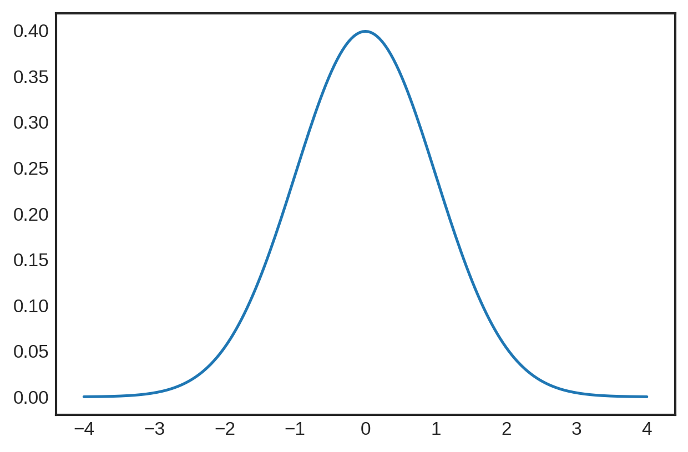
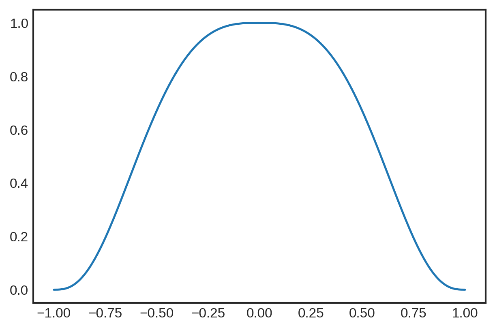
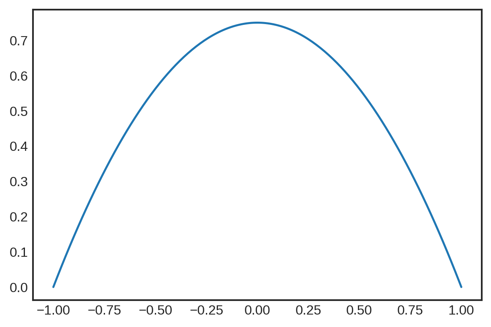
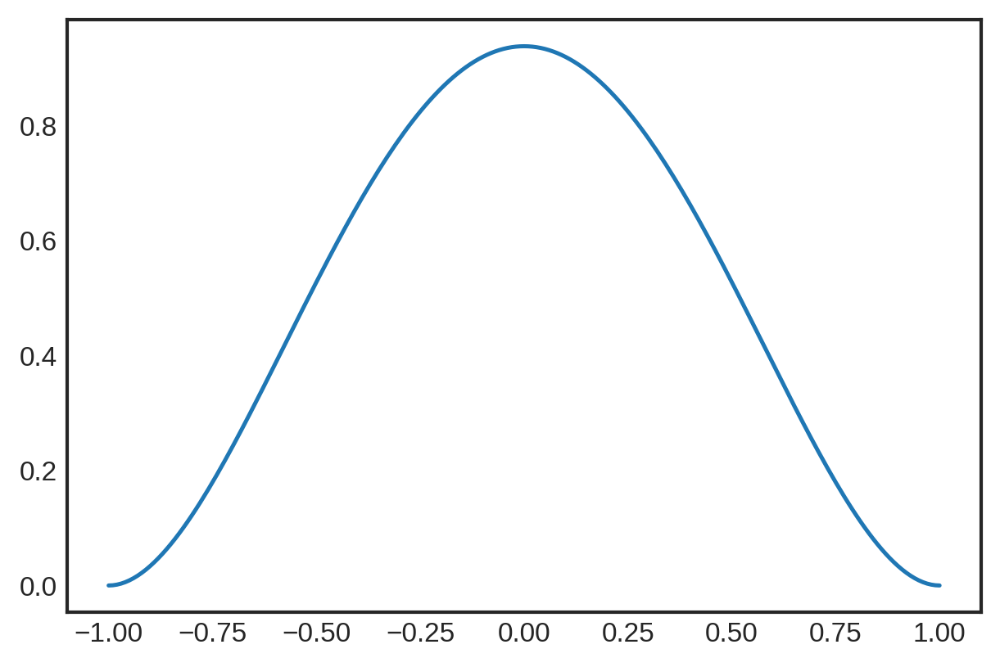

# Project 1: Lowess
## Willem Morris
---
## **Introduction**
The main idea behind locally weighted regression (lowess) is to use traditional linear regression on nonlinear data but introduce another weights matrix into the equation to weight data points closer to data points as more than farther away points. 

Linear regression equation: 
$$\large y = X\cdot\beta +\sigma\epsilon $$

Locally weighted regression equation:
$$\large \text{diag}(W(i))y = \text{diag}(W(i))X\cdot\beta +\sigma \text{diag}(W(i))\epsilon $$

Lowess animation from the scikit-lego documentation:
<figure>
<center>

<figcaption>Example of how weights work</figcaption></center>
</figure>


<figure>
<center>

<figcaption>Example of how locally weighted regression works</figcaption></center>
</figure>

## **Kernels**

Kernel functions are used to calculate the weights matrix. In addition to x, each function takes tau as a hyperparameter, referred to as the bandwidth. 

Here are few kernel functions with their corresponding graph:

1.   The Gaussian Kernel

$$ K(x):=\frac{1}{2\pi}e^{-\frac{1}{2}x^2} $$


2.   The Tricubic Kernel

$$ K(x):=\begin{cases}
(1-\|x\|^3)^3 \;\;\;if \;\;\; \|x\|<1 \\
0 \;\;\; \text{otherwise}
\end{cases}
$$


3.   The Epanechnikov Kernel

$$ K(x):=\begin{cases}
\frac{3}{4}(1-\|x\|^2) \;\;\;if \;\;\; \|x\|<1 \\
0 \;\;\; \text{otherwise}
\end{cases}
$$


4.   The Quartic Kernel

$$ K(x):=\begin{cases}
\frac{15}{16}(1-\|x\|^2)^2 \;\;\;if \;\;\; \|x\|<1 \\
0 \;\;\; \text{otherwise}
\end{cases}
$$


The kernel function is passed the data x and tau, a hyperparameter referred to as the bandwidth, and outputs the weights for the data x.


The python code for lowess is:
```python
def kernel_function(xi,x0,kern, tau): 
    return kern((xi - x0)/(2*tau))

def weights_matrix(x,kern,tau):
  n = len(x)
  return np.array([kernel_function(x,x[i],kern,tau) for i in range(n)]) 

def lowess(x, y, kern, tau=0.05):
    # tau is called bandwidth K((x-x[i])/(2*tau))
    # tau is a hyper-parameter
    n = len(x)
    yest = np.zeros(n)
    
    #Initializing all weights from the bell shape kernel function       
    #Looping through all x-points
    
    w = weights_matrix(x,kern,tau)    
    
    #Looping through all x-points
    for i in range(n):
        weights = w[:, i]
        lm.fit(np.diag(w[:,i]).dot(x.reshape(-1,1)),np.diag(w[:,i]).dot(y.reshape(-1,1)))
        yest[i] = lm.predict(x[i].reshape(-1,1)) 

    return yest
```

## **Testing**
<!--  -->